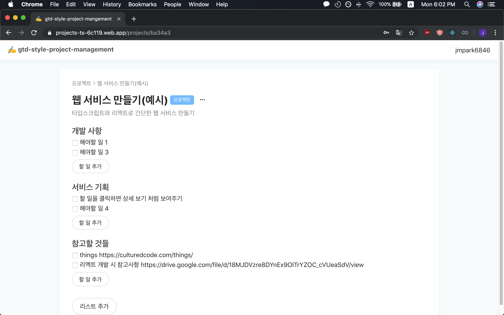
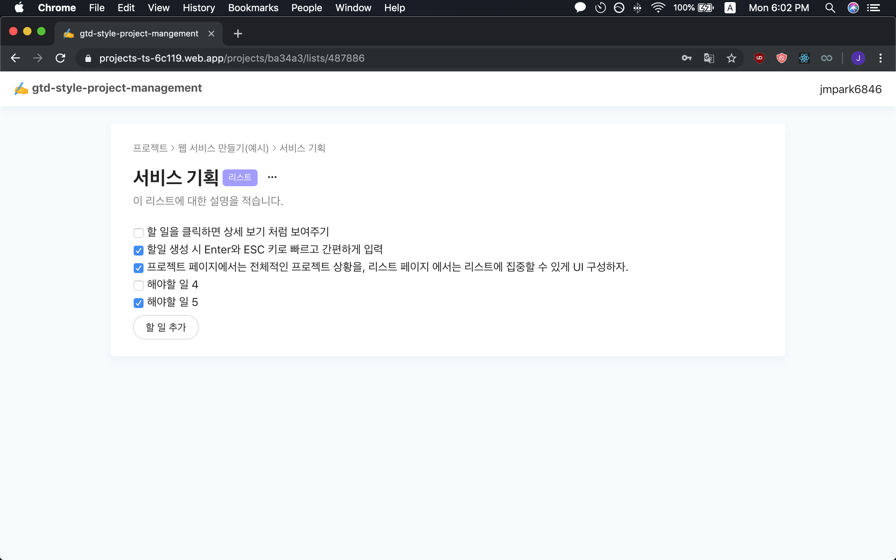

# gtd-style-project-mangement

타입스크립트와 리엑트로 만든 Getting Thins Done 스타일의 개인 프로젝트 관리 도구  
Typescript, React, React Hooks, styled-components, react-testing-library와 Firebase Firestore database, Authentication 서비스 사용

### 개발 환경

- React 16.9.0
- styled-components 4.3.2
- firebase 6.4.0
- typescript 3.5.3
- @reach/router 1.2.1
